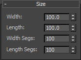
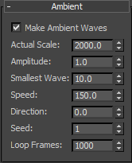
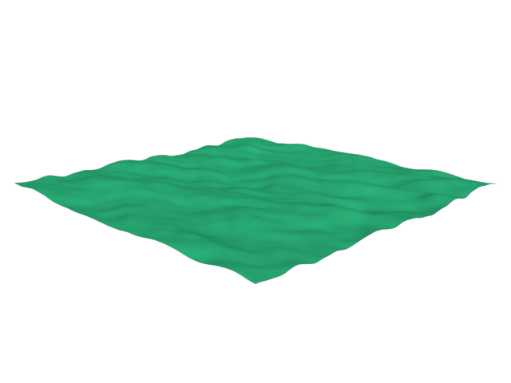
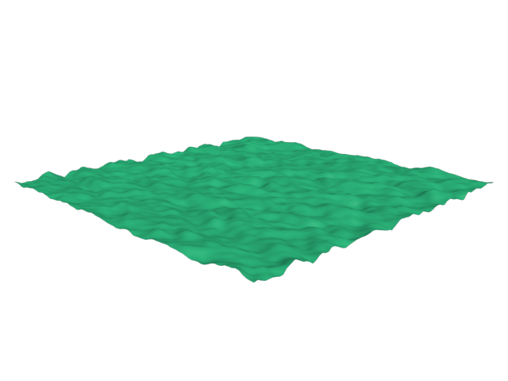
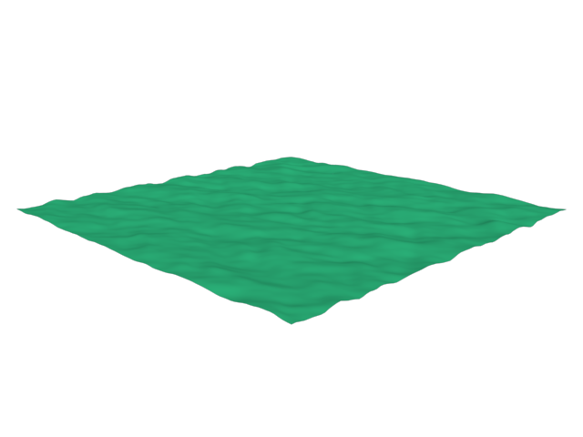
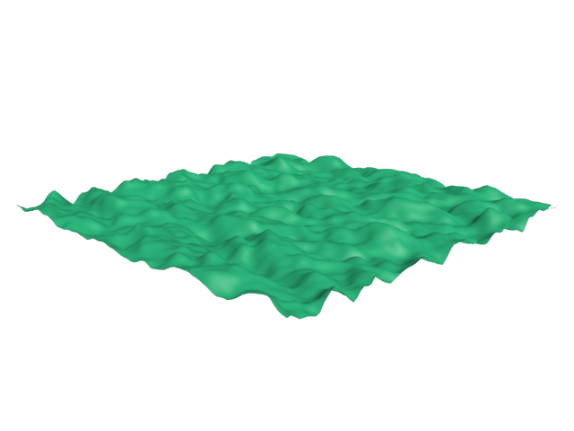
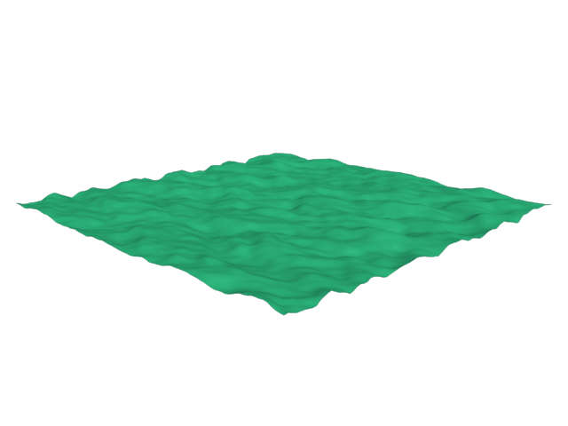
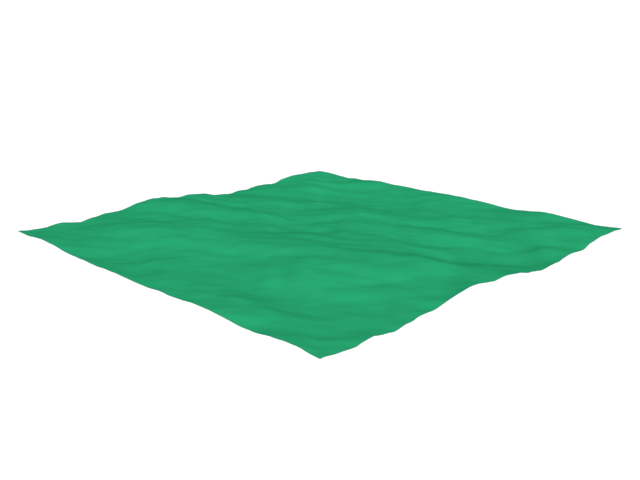
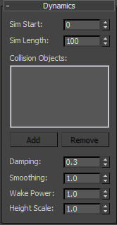
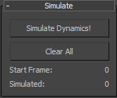

Using the Plugin
================

Creating a New Instance
-----------------------
The plugin appears in the Command Panel > Simulations category > iWaveOcean.
To create a new object instance, simply click on the iWaveOcean button and then drag in a viewport to define the ocean plane.
Note that this object is a "world-space object" and relies on its position in world space in order to calculate collisions.
Thus, you will be able to clone the object as a copy, but not as an instance or reference.

Size Rollup
-----------

*Width*. The width of the simulation plane.

*Length*. The length of the simulation plane.

*Width Segs*. The number of face segments along the width axis of the plane. (The number of vertices is one greater.)

*Length Segs*. The number of face segments along the length axis of the plane. (The number of vertices is one greater.)

Ambient Rollup
--------------

*Make Ambient Waves*. Check this box if you would like ambient waves, such as those in an ocean or a lake, to be generated.
If no manual simulation has been run and cached, the ambient waves will be generated live as you scrub the time slider or change the ambient wave properties.
Most of the ambient wave properties can also be animated, in contrast to the dynamic wave properties.

*Actual Scale*. The width of the plane used in the ambient wave simulation algorithms.
The basic effect of increasing this factor is to simulate a larger ocean in the same area, making waves appear smaller and shallower.
In contrast, increasing this factor simulates a smaller ocean in the same area, making waves appear larger and more powerful.
Animatable.

Actual Scale = 1000.0 in                                             | Actual Scale = 3000.0 in
-------------------------------------------------------------------- | --------------------------------------------------------------------
 | 

*Amplitude*. Actually the semi-amplitude.
The height of the tallest wave, as measured from the origin of the plane.
(Note that you probably want to increase the amplitude in lockstep with the speed.)
Animatable.

Amplitude = 1.0                                                 | Amplitude = 4.0
--------------------------------------------------------------- | ---------------------------------------------------------------
 | 

*Smallest Wave*. The smallest wave size that will actually be rendered; any wave smaller than this size will be removed from the ambient simulation.
Animatable.

*Speed*. The speed of the wind blowing on the waves.
Faster speed will give larger waves at higher frequencies.
(Note that you probably want to increase the speed in lockstep with the amplitude.)
Animatable.

Speed = 200.0 in/second                                        | Speed = 400.0 in/second
-------------------------------------------------------------- | --------------------------------------------------------------
 | 

*Direction*. The angle (degrees) of the wind blowing on the waves.
Animatable.

*Seed*. An integer seed used for the random number generator used to generate the ambient wave pattern.
Choose a different one to create a different wave pattern.

*Loop Length*. The amount of time after which the animation will loop.
By default, this is specified in frames unless you have changed your 3ds Max Time Configuration.

Dynamics Rollup
---------------

The properties specified under the "Dynamics" rollup cannot be previewed live in the viewport, nor can they be animated.
To see their effect on the simulation, you must re-run the simulation by using the "Simulate" rollup (see below).

*Sim Start*. The time on which to start simulating.
By default, this is specified in frames unless you have changed your 3ds Max Time Configuration.

*Sim Length*. The amount of time for which to simulate.
By default, this is specified in frames unless you have changed your 3ds Max Time Configuration.

*Collision Objects*. The objects that interact with the waves.
Use the Add and Remove buttons to choose geometry objects from the scene.

*Damping*. A factor that controls how much the waves are damped; higher values increase damping.

*Smoothing*. A factor that determines the smoothness of the hit-tested outline generated for collision objects.
This factor is simply σ, the standard deviation for the Gaussian distribution.
A higher value of σ gives smoother boundaries around a collision object, while a lower value of σ gives sharper boundaries.

*Height Scale*. A factor by which to multiply the height of dynamically-simulated waves.

Simulate Rollup
---------------

*Simulate Dyanmics* button. Click this button to start simulating from the "Sim Start" frame.
This button will bring up a dialog with the simulation progress, wherein you can cancel the simulation midway.

*Clear All* button. Click this button to erase all saved simulation frames.

*Start Frame*. The first frame of the saved simulation data.
This value is specified in frames regardless of the current Time Configuration.
This number may not match the "Sim Start" property if you have changed the "Sim Start" without re-simulating.

*Simulated*. The number of frames simulated thus far.
This value is specified in frames regardless of the current Time Configuration.
This number may not match the "Sim Length" property if you have cancelled a simulation midway, or if you have changed the "Sim Length" property without re-simulating.